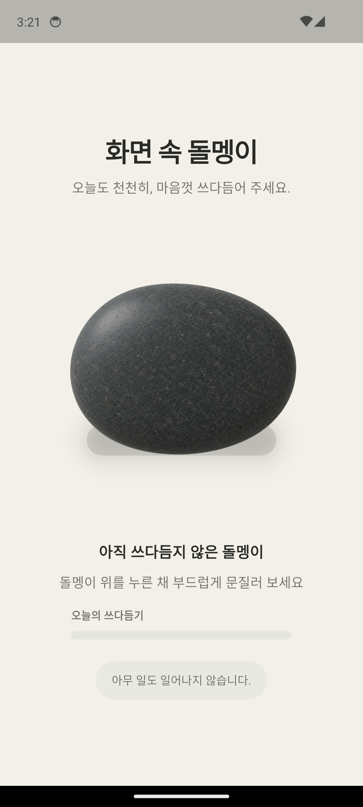
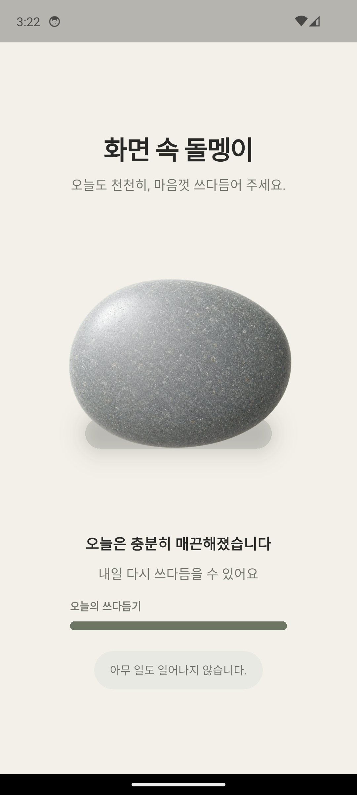

# 화면 속 돌멩이

매일 돌멩이를 천천히 쓰다듬으면 표면에 조금씩 윤기가 쌓이는 조용한 Flutter 앱입니다.
돌멩이를 쓰다듬는 것 외에는 아무 일도 일어나지 않습니다.

## 화면 비교

| 문지르기 전 | 오늘의 문지르기 완료 |
| --- | --- |
|  |  |

## 주요 기능

- 마우스와 터치 드래그를 모두 지원합니다.
- 드래그를 놓은 횟수가 아니라 실제로 문지른 거리를 연속 진행도로 환산합니다.
- 진행도에 따라 실사 돌의 밝기와 표면 반사가 단계 없이 자연스럽게 증가합니다.
- 드래그 중에는 손끝을 따라 국소 하이라이트가 이동하고, 손을 떼면 즉시 사라집니다.
- 오늘의 게이지가 가득 차면 다음 로컬 날짜에 다시 문지를 수 있습니다.
- 누적 윤기, 오늘의 진행도, 마지막 문지른 날짜를 기기에 저장합니다.
- 기존 횟수 기반 저장 데이터도 연속 진행도 형식으로 이전합니다.

## 개발 테스트 기능

화면 좌측 상단의 투명한 48×48 영역을 누르면 오늘의 게이지와 누적 저장값이
초기화됩니다. 화면에는 노출되지 않는 테스트용 치트 버튼입니다.

## 구조

프로젝트는 Panel–Section–Controller 경계를 따릅니다.

- `RockHomePanel`: 돌멩이 화면 조립
- `RockGardenSection`: 실사 돌, 드래그 입력, 진행 바와 광택 표현
- `RockHomeController`: 날짜와 문지름 거리 기반 상태 전이
- `RockCareAction`: `shared_preferences` 저장과 이전 데이터 마이그레이션

## 실행

```bash
flutter pub get
flutter run
```

## 검증

```bash
flutter analyze
flutter test
flutter build apk --debug
```

검증 범위에는 넓은 화면 중앙 정렬, 연속 거리 누적, 드래그 종료 후 하이라이트
제거, 날짜 변경 후 재활성화, 저장 마이그레이션과 치트 초기화가 포함됩니다.
